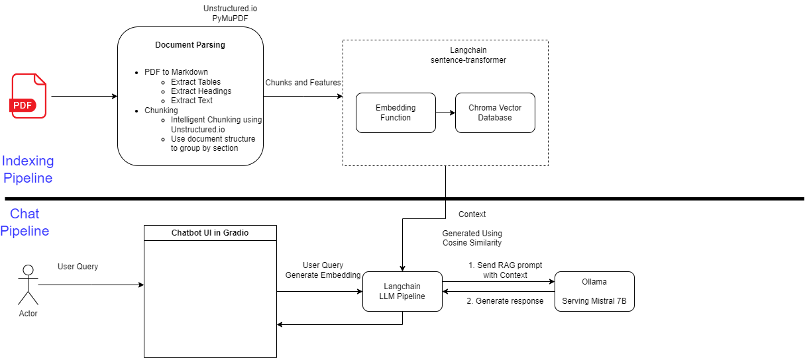

# Objective

Design a custom RAG pipeline to answer questions from this textbook -

> https://openstax.org/details/books/concepts-biology

## Important Pointers:

1. Download the pdf from the link above
2. To make indexing faster, you can pick any 2 chapters from the pdf and treat it as a source.
3. Use any in-memory vector database if required.
4. Use any open source HuggingFace model as the LLM Model

## Output

* Entire codebase in GitHub with links to access artifacts we need for evaluation:
    - Please add docstrings wherever necessary.
* Additional Colab notebook to run the backend logic and evaluations:
    - Please add text blocks in your Colab to add scenarios/assumptions etc to make it readable.
* Any additional artifacts like system design architecture, assumptions, list of issues you couldn’t solve because of time constraints and how you can fix it in future.

## Additional (bonus):

1. Streamlit/Gradio Frontend to interact with your pipeline
2. Wrap the entire application inside a docker container
3. Draft and implement all the necessary APIs using FastAPI or any other python web framework of choice
4. Produce alternative way to do the RAG without using any library like Langchain, LLamaIndex or Haystack

# Architecture Diagram for RAG Pipeline

